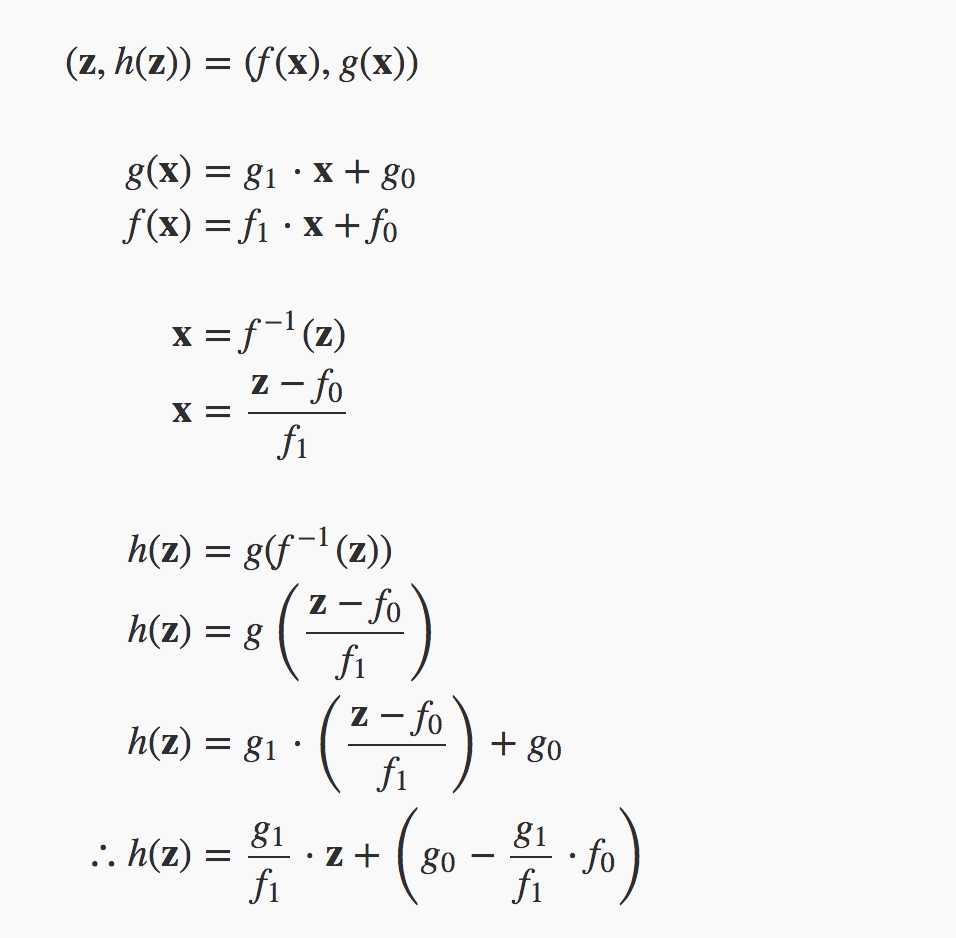
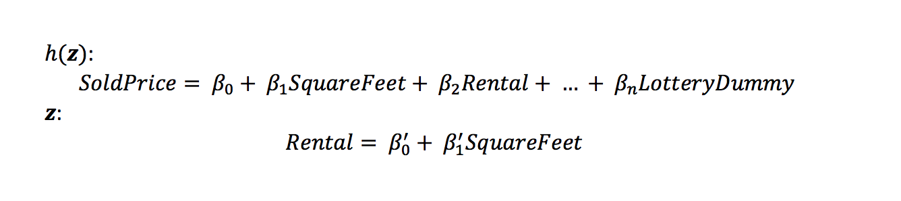
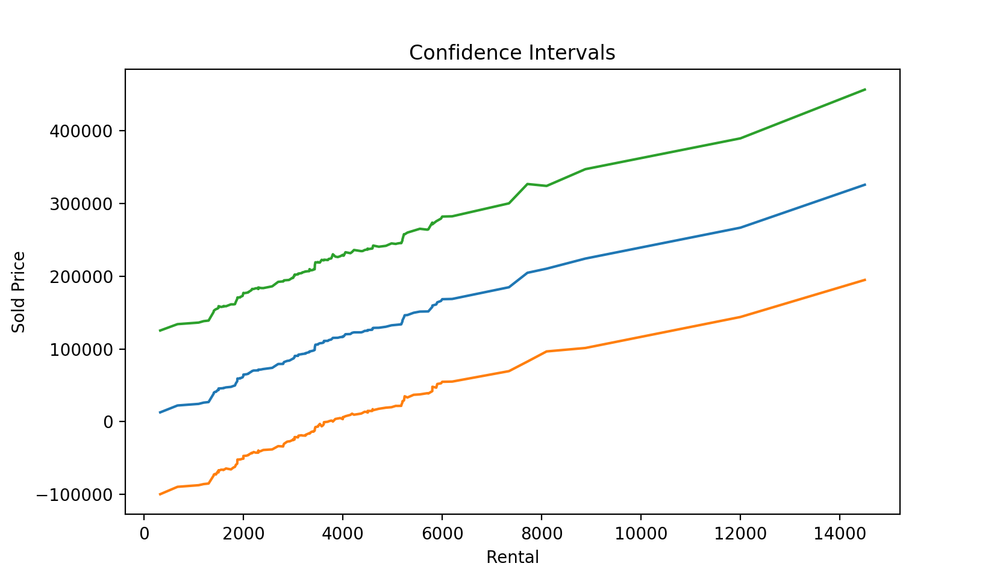
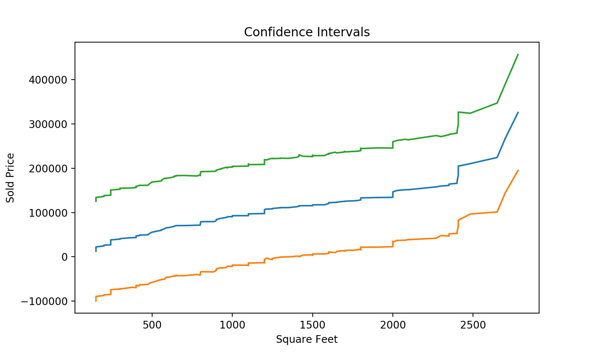
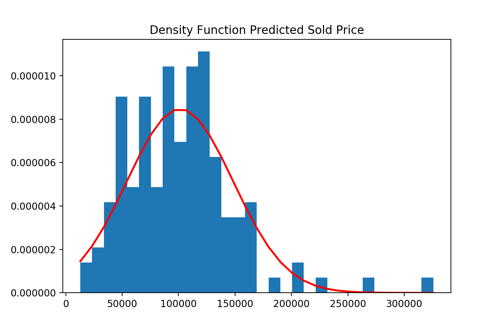
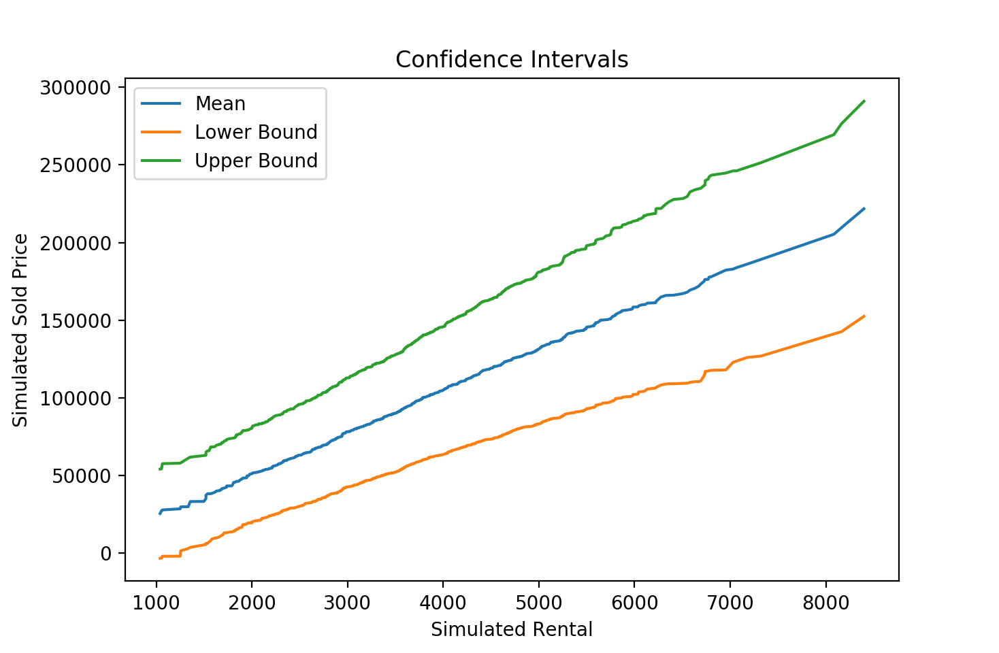
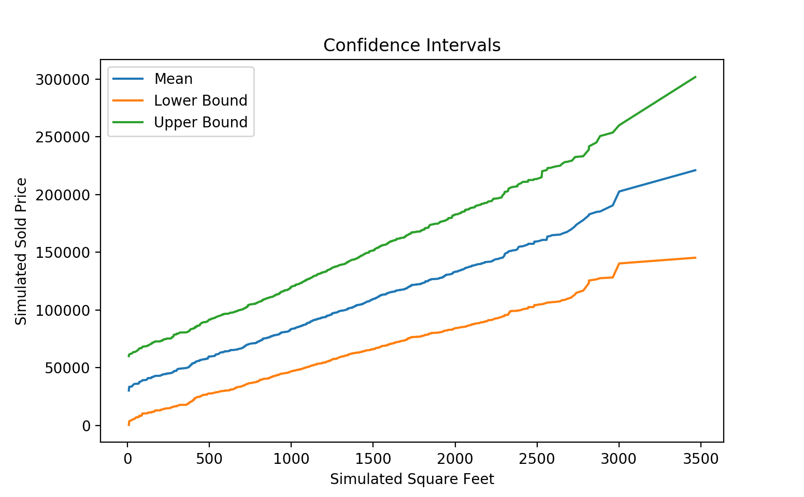
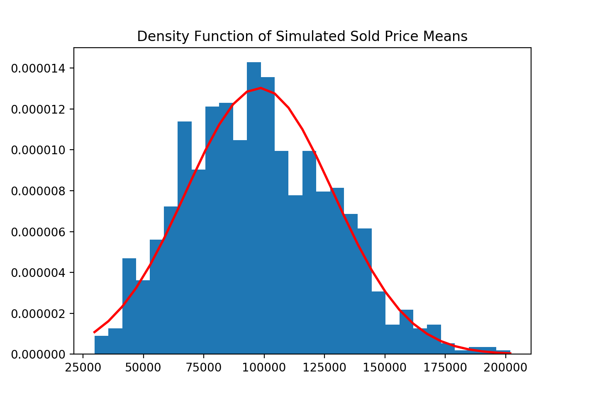

# Monte Carlo Simulation for Calculating Confidence Intervals with Presence of Multicollinearity in Model

In the model, variables Rental and Square Feet are highly correlated but they both have significant contributions to the response variable Sold Pice.

In order to overcome the multicollinearity issue, linear transformation for Rental is used and all numerical variables (Rental, Square Feet) and coefficients in the model are simulated.

## Confidence Intervals when Rental is correlated to Square Feet

## Sold Price probability density function

## Simulated Confidence Intervals

## Simulated Sold Price probability density function

When there is a strong correlation between explanatory variables, the model confidence intervals for the reponse variable tend to be much wider.

After Monte Carlo simulation, the simulated y has much narrower confidence intervals. And the true relationships between y and X are shown.