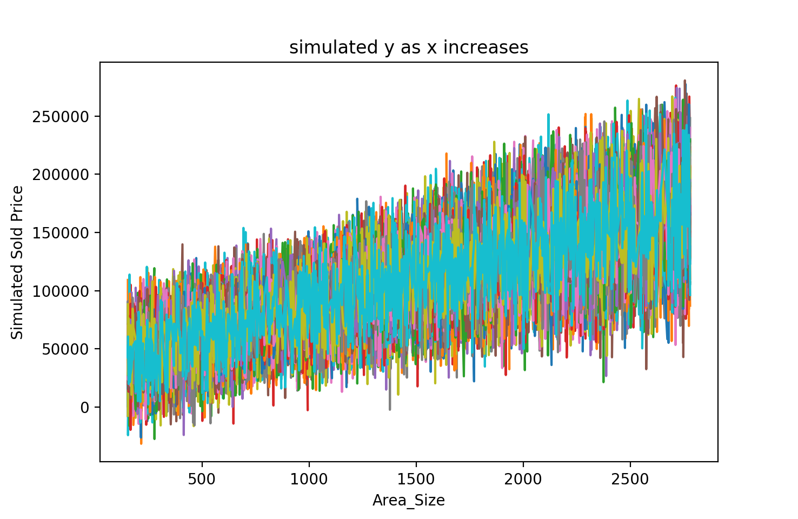
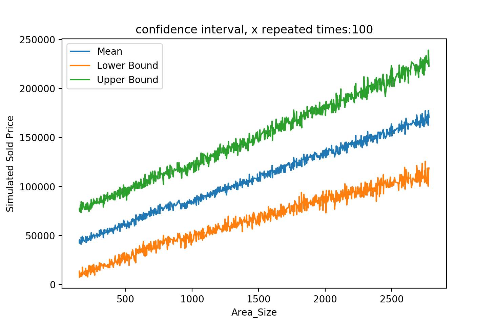
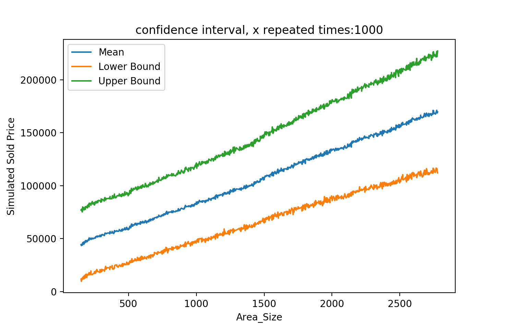
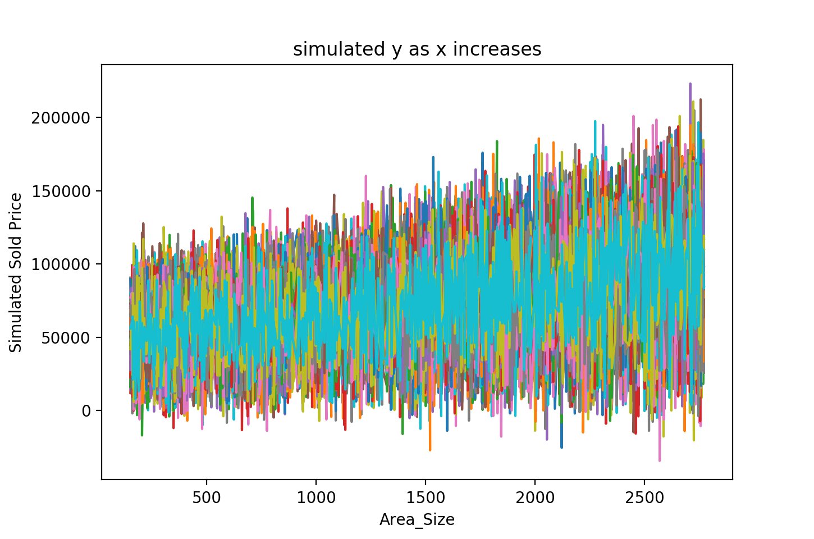
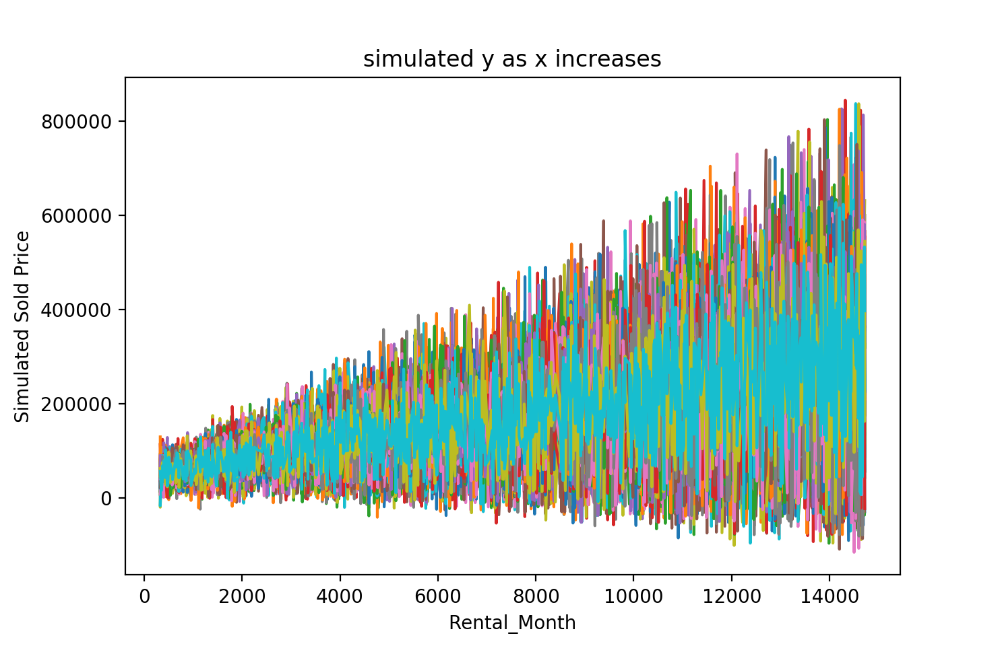
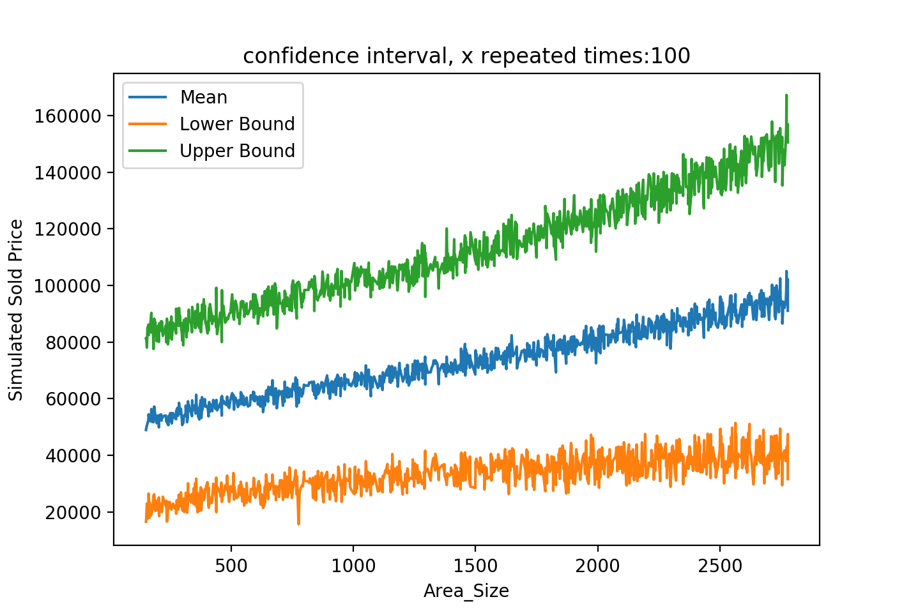
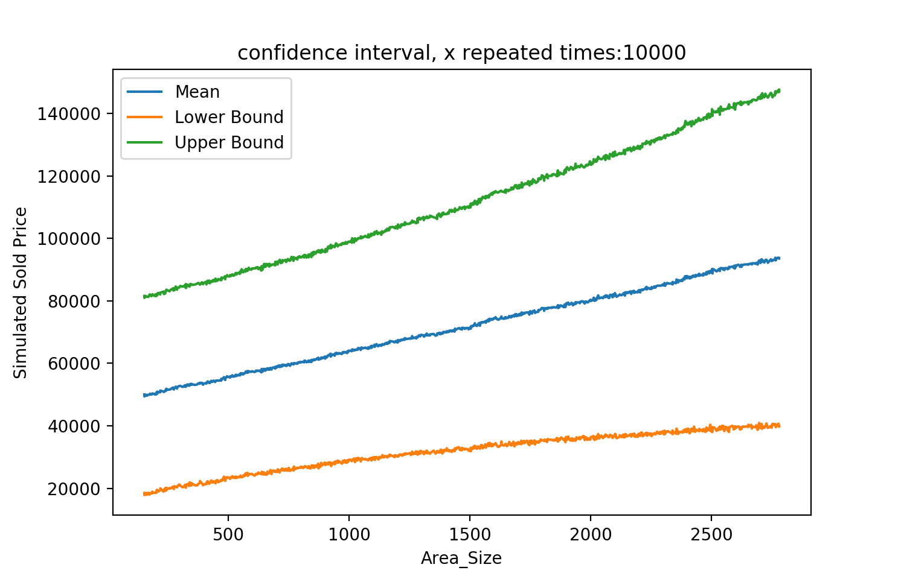

# Monte Carlo Simulations for OLS
## Simulated y
Choose one observation, keep other variables fixed, with generated coefficient samples (normal distribution) and one generated variable (Area Size) sample (uniform distribution), loop through Area Size sample with each iteration repeating x 100 times, the true relationship is shown between y (Sold Price) and x (Area Size).

## Confidence intervals for simulated y
As the times of x repetition increse, from 100 to 10000, the simulated confidence intervals (95%) tend to have less fluctuation and are closer to straight lines (which are the true confidence intervals for the simulated y). In each iteration, the simulated y sample size gets bigger and the simulated y distribution gets closer to the true distribution.

## Confidence intervals when there is a strong correlation among two variables

Predictor Area Size and Rental have a significant correlation.
The true relationships between y and X are violated. And simulated y distribution is less normal distribution.

